# 🌟 ¡Hola, soy Jamar Masias! 🌟

### 👩💻 Futura Ingeniera de Software & Entusiasta del Web3

  

---

## 🛠️ Mi Stack Tecnológico

**💎 Frontend Avanzado**
 

**🔮 Backend & Blockchain**
 

**🛡️ Seguridad & Bases de Datos**
 

**📱 Desarrollo Móvil**
 

---

## 🚀 Mi Viaje en el Mundo Tech

```mermaid
graph LR
A[Estudiante de Ingeniería de Software] --> B[Desarrolladora Full Stack]
B --> C[Especialización en Web3]
B --> D[Seguridad Informática]
C --> E[Desarrollo Blockchain]
D --> F[Hacking Ético]
E --> G[Contratos Inteligentes]
F --> H[Pentesting]
```

---

## 🌱 Actualmente Explorando

  
| Área | Tecnologías |
| :--- | :--- |
| **🔐 Ciberseguridad** | Kali Linux, Metasploit, Wireshark, Burp Suite |
| **🌐 Web3** | Solidity, Smart Contracts, DeFi, DApps |
| **📊 Bases de Datos** | PostgreSQL avanzado, Optimización de consultas |
| **🧠 Machine Learning** | Python, TensorFlow, Proyectos de IA |

---

## 📊 Mi Estadísticas de Código

---

## 🎯 Metas Profesionales

1. **🏆 Convertirme en Ingeniera de Software especializada en seguridad**
2. **🔓 Obtener certificaciones en hacking ético (CEH, OSCP)**
3. **🌐 Desarrollar DApps innovadoras en la blockchain**
4. **👩💻 Mentorear a otras mujeres en tech**
5. **🚀 Contribuir a proyectos open source de ciberseguridad**

---

## ✨ Dato Curioso

> *"Soy risueña por naturaleza pero seria con el código. Mi misión es demostrar que se puede ser una hacker ética con sonrisa incluida. 💖"*

---

## 📫 Conectemos!

---

  
   
  <em>✨ Transformando líneas de código en soluciones seguras para el futuro</em>

